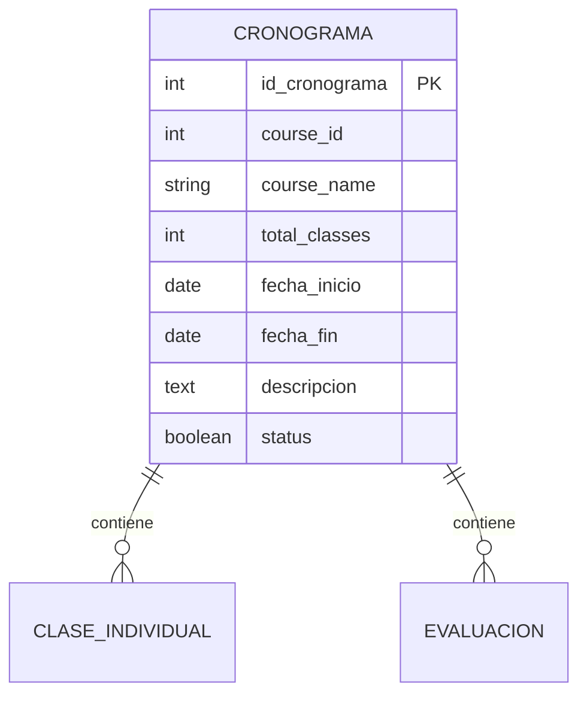
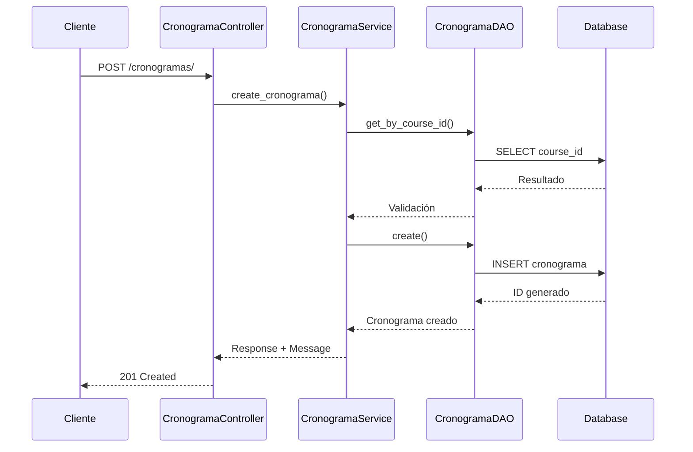
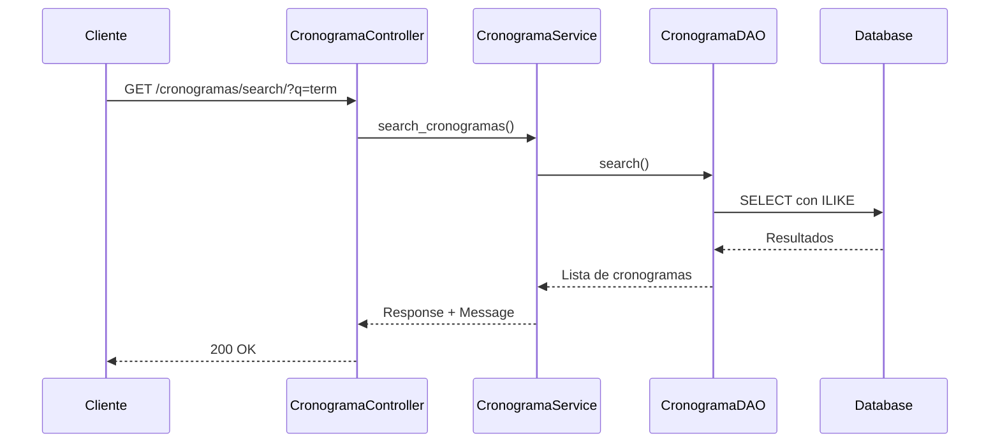

# 📅 API de Cronograma - Documentación Técnica

## Descripción General

El módulo **Cronograma** es el núcleo del sistema de planificación académica. Gestiona la información general de cursos, incluyendo fechas de inicio/fin, descripción y metadatos del curso proveniente del módulo CORE.

## 🏗️ Arquitectura

```
┌─────────────────────┐    ┌─────────────────────┐    ┌─────────────────────┐    ┌─────────────────────┐
│   Controller        │───▶│   Service          │───▶│   DAO              │───▶│   Model             │
│   (HTTP Layer)      │    │   (Business Logic) │    │   (Data Access)    │    │   (Database)       │
└─────────────────────┘    └─────────────────────┘    └─────────────────────┘    └─────────────────────┘
```

### Componentes

- **CronogramaController**: Maneja requests HTTP y responses
- **CronogramaService**: Lógica de negocio y validaciones
- **CronogramaDAO**: Acceso a datos asíncrono
- **Cronograma Model**: Entidad de base de datos

## 📊 Modelo de Datos

### Estructura de la Tabla

```sql
CREATE TABLE cronogramas (
    id_cronograma SERIAL PRIMARY KEY,
    course_id INTEGER NOT NULL,                    -- ID del curso del módulo CORE
    course_name VARCHAR(200) NOT NULL,            -- Nombre del curso (cacheado)
    total_classes INTEGER DEFAULT 0,              -- Total de clases planificadas
    fecha_inicio DATE,                            -- Fecha de inicio del cronograma
    fecha_fin DATE,                              -- Fecha de fin del cronograma
    descripcion TEXT,                            -- Descripción detallada
    fecha_creacion TIMESTAMP DEFAULT CURRENT_TIMESTAMP,
    fecha_modificacion TIMESTAMP DEFAULT CURRENT_TIMESTAMP,
    status BOOLEAN DEFAULT TRUE                   -- Estado del cronograma
);
```

### Relaciones



## 🔌 API Endpoints

### 1. Crear Cronograma

```http
POST /cronogramas/
Content-Type: application/json

{
    "course_id": 101,
    "course_name": "Bases de Datos II",
    "total_classes": 16,
    "fecha_inicio": "2024-02-15",
    "fecha_fin": "2024-06-15",
    "descripcion": "Curso avanzado de bases de datos relacionales"
}
```

**Response:**
```json
{
    "cronograma": {
        "id_cronograma": 1,
        "course_id": 101,
        "course_name": "Bases de Datos II",
        "total_classes": 16,
        "fecha_inicio": "2024-02-15",
        "fecha_fin": "2024-06-15",
        "descripcion": "Curso avanzado de bases de datos relacionales",
        "status": true,
        "fecha_creacion": "2024-01-15T10:30:00Z",
        "fecha_modificacion": "2024-01-15T10:30:00Z"
    },
    "message": "Cronograma creado exitosamente"
}
```

### 2. Listar Cronogramas

```http
GET /cronogramas/?skip=0&limit=100&status_filter=true
```

**Query Parameters:**
- `skip` (int): Número de registros a omitir (default: 0)
- `limit` (int): Número máximo de registros (default: 100, max: 1000)
- `status_filter` (bool): Filtrar por estado (true=activo, false=inactivo)

**Response:**
```json
[
    {
        "id_cronograma": 1,
        "course_id": 101,
        "course_name": "Bases de Datos II",
        "total_classes": 16,
        "fecha_inicio": "2024-02-15",
        "fecha_fin": "2024-06-15",
        "descripcion": "Curso avanzado de bases de datos relacionales",
        "status": true,
        "fecha_creacion": "2024-01-15T10:30:00Z",
        "fecha_modificacion": "2024-01-15T10:30:00Z"
    }
]
```

### 3. Obtener Cronograma por ID

```http
GET /cronogramas/1
```

**Response:**
```json
{
    "id_cronograma": 1,
    "course_id": 101,
    "course_name": "Bases de Datos II",
    "total_classes": 16,
    "fecha_inicio": "2024-02-15",
    "fecha_fin": "2024-06-15",
    "descripcion": "Curso avanzado de bases de datos relacionales",
    "status": true,
    "fecha_creacion": "2024-01-15T10:30:00Z",
    "fecha_modificacion": "2024-01-15T10:30:00Z"
}
```

### 4. Actualizar Cronograma

```http
PUT /cronogramas/1
Content-Type: application/json

{
    "course_name": "Bases de Datos II - Actualizado",
    "total_classes": 18,
    "descripcion": "Curso actualizado con más contenido"
}
```

**Response:**
```json
{
    "cronograma": {
        "id_cronograma": 1,
        "course_id": 101,
        "course_name": "Bases de Datos II - Actualizado",
        "total_classes": 18,
        "fecha_inicio": "2024-02-15",
        "fecha_fin": "2024-06-15",
        "descripcion": "Curso actualizado con más contenido",
        "status": true,
        "fecha_creacion": "2024-01-15T10:30:00Z",
        "fecha_modificacion": "2024-01-15T11:45:00Z"
    },
    "message": "Cronograma actualizado exitosamente"
}
```

### 5. Eliminar Cronograma

```http
DELETE /cronogramas/1
```

**Response:**
```json
{
    "message": "Cronograma eliminado exitosamente"
}
```

### 6. Buscar Cronogramas

```http
GET /cronogramas/search/?q=bases%20datos&skip=0&limit=100
```

**Query Parameters:**
- `q` (string): Término de búsqueda (mínimo 2 caracteres)
- `skip` (int): Número de registros a omitir
- `limit` (int): Número máximo de registros

### 7. Cronogramas por Rango de Fechas

```http
GET /cronogramas/date-range/?fecha_inicio=2024-02-01&fecha_fin=2024-06-30
```

### 8. Estadísticas

```http
GET /cronogramas/stats/
```

**Response:**
```json
{
    "total_cronogramas": 15,
    "active_cronogramas": 12,
    "inactive_cronogramas": 3,
    "cronogramas_with_classes": 10,
    "cronogramas_without_classes": 2
}
```

## ✅ Validaciones de Negocio

### 1. **Unicidad de Course ID**
- No puede existir más de un cronograma activo para el mismo `course_id`
- Error: `"Ya existe un cronograma para el curso ID {course_id}"`

### 2. **Validación de Fechas**
- `fecha_fin` debe ser posterior a `fecha_inicio`
- Error: `"La fecha de fin debe ser posterior a la fecha de inicio"`

### 3. **Integridad Referencial**
- No se puede eliminar un cronograma que tenga clases o evaluaciones asociadas
- Error: `"No se puede eliminar un cronograma que tiene clases/evaluaciones asociadas"`

### 4. **Campos Obligatorios**
- `course_id`: Requerido
- `course_name`: Requerido, máximo 200 caracteres
- `total_classes`: Requerido, entero positivo

## 🔧 Código de Ejemplo

### Python (requests)

```python
import requests
from datetime import date

# Configuración
BASE_URL = "http://localhost:8000"
headers = {"Content-Type": "application/json"}

# Crear cronograma
def crear_cronograma(course_id, course_name, total_classes, fecha_inicio, fecha_fin, descripcion=None):
    data = {
        "course_id": course_id,
        "course_name": course_name,
        "total_classes": total_classes,
        "fecha_inicio": fecha_inicio,
        "fecha_fin": fecha_fin,
        "descripcion": descripcion
    }
    
    response = requests.post(f"{BASE_URL}/cronogramas/", json=data, headers=headers)
    
    if response.status_code == 201:
        return response.json()["cronograma"]
    else:
        raise Exception(f"Error: {response.json()['detail']}")

# Buscar cronogramas
def buscar_cronogramas(termino, skip=0, limit=100):
    params = {"q": termino, "skip": skip, "limit": limit}
    response = requests.get(f"{BASE_URL}/cronogramas/search/", params=params)
    return response.json()

# Obtener estadísticas
def obtener_estadisticas():
    response = requests.get(f"{BASE_URL}/cronogramas/stats/")
    return response.json()

# Ejemplo de uso
try:
    cronograma = crear_cronograma(
        course_id=101,
        course_name="Bases de Datos II",
        total_classes=16,
        fecha_inicio="2024-02-15",
        fecha_fin="2024-06-15",
        descripcion="Curso avanzado de bases de datos relacionales"
    )
    print(f"Cronograma creado: {cronograma['id_cronograma']}")
    
    # Buscar cronogramas
    resultados = buscar_cronogramas("bases datos")
    print(f"Encontrados {len(resultados)} cronogramas")
    
    # Estadísticas
    stats = obtener_estadisticas()
    print(f"Total de cronogramas: {stats['total_cronogramas']}")
    
except Exception as e:
    print(f"Error: {e}")
```

### JavaScript (fetch)

```javascript
const BASE_URL = 'http://localhost:8000';

// Crear cronograma
async function crearCronograma(courseId, courseName, totalClasses, fechaInicio, fechaFin, descripcion = null) {
    const data = {
        course_id: courseId,
        course_name: courseName,
        total_classes: totalClasses,
        fecha_inicio: fechaInicio,
        fecha_fin: fechaFin,
        descripcion: descripcion
    };
    
    try {
        const response = await fetch(`${BASE_URL}/cronogramas/`, {
            method: 'POST',
            headers: {
                'Content-Type': 'application/json'
            },
            body: JSON.stringify(data)
        });
        
        if (response.ok) {
            const result = await response.json();
            return result.cronograma;
        } else {
            const error = await response.json();
            throw new Error(error.detail);
        }
    } catch (error) {
        console.error('Error:', error.message);
        throw error;
    }
}

// Buscar cronogramas
async function buscarCronogramas(termino, skip = 0, limit = 100) {
    const params = new URLSearchParams({
        q: termino,
        skip: skip.toString(),
        limit: limit.toString()
    });
    
    try {
        const response = await fetch(`${BASE_URL}/cronogramas/search/?${params}`);
        return await response.json();
    } catch (error) {
        console.error('Error:', error);
        throw error;
    }
}

// Ejemplo de uso
(async () => {
    try {
        const cronograma = await crearCronograma(
            101,
            "Bases de Datos II",
            16,
            "2024-02-15",
            "2024-06-15",
            "Curso avanzado de bases de datos relacionales"
        );
        console.log('Cronograma creado:', cronograma.id_cronograma);
        
        const resultados = await buscarCronogramas("bases datos");
        console.log(`Encontrados ${resultados.length} cronogramas`);
        
    } catch (error) {
        console.error('Error:', error.message);
    }
})();
```

## 🚨 Códigos de Error

| Código | Descripción | Solución |
|--------|-------------|----------|
| `400` | Datos de entrada inválidos | Verificar formato y validaciones |
| `404` | Cronograma no encontrado | Verificar ID del cronograma |
| `409` | Conflicto (course_id duplicado) | Usar un course_id diferente |
| `500` | Error interno del servidor | Contactar soporte técnico |

## 📈 Métricas y Monitoreo

### Logs Importantes

```python
# Creación exitosa
INFO: Cronograma creado exitosamente: ID 1

# Error de validación
ERROR: Error creando cronograma: Ya existe un cronograma para el curso ID 101

# Actualización
INFO: Cronograma actualizado exitosamente: ID 1
```

### Métricas de Rendimiento

- **Tiempo de respuesta promedio**: < 200ms
- **Throughput**: 1000 requests/minuto
- **Disponibilidad**: 99.9%

## 🔄 Flujos de Trabajo

### Flujo 1: Creación de Cronograma



### Flujo 2: Búsqueda de Cronogramas



## 🧪 Testing

### Casos de Prueba

```python
import pytest
from fastapi.testclient import TestClient
from app import app

client = TestClient(app)

def test_crear_cronograma_exitoso():
    """Test: Crear cronograma con datos válidos"""
    data = {
        "course_id": 101,
        "course_name": "Test Course",
        "total_classes": 10,
        "fecha_inicio": "2024-02-01",
        "fecha_fin": "2024-06-01"
    }
    
    response = client.post("/cronogramas/", json=data)
    assert response.status_code == 201
    assert "cronograma" in response.json()

def test_crear_cronograma_duplicado():
    """Test: Error al crear cronograma duplicado"""
    data = {
        "course_id": 101,
        "course_name": "Test Course",
        "total_classes": 10
    }
    
    # Primera creación
    client.post("/cronogramas/", json=data)
    
    # Segunda creación (debe fallar)
    response = client.post("/cronogramas/", json=data)
    assert response.status_code == 400
    assert "Ya existe un cronograma" in response.json()["detail"]

def test_fechas_invalidas():
    """Test: Error con fechas inválidas"""
    data = {
        "course_id": 102,
        "course_name": "Test Course",
        "total_classes": 10,
        "fecha_inicio": "2024-06-01",
        "fecha_fin": "2024-02-01"  # Fecha fin anterior a inicio
    }
    
    response = client.post("/cronogramas/", json=data)
    assert response.status_code == 400
    assert "fecha de fin debe ser posterior" in response.json()["detail"]
```

## 🔧 Configuración Avanzada

### Variables de Entorno

```bash
# Base de datos
DATABASE_HOST=localhost
DATABASE_PORT=5432
DATABASE_NAME=backoffice_db
DATABASE_USER=postgres
DATABASE_PASSWORD=secure_password

# Servidor
SERVER_HOST=0.0.0.0
SERVER_PORT=8000
ENVIRONMENT=production

# Logging
LOG_LEVEL=INFO
LOG_FORMAT=json
```

### Configuración de Base de Datos

```python
# rest/database.py
import asyncpg
import os

async def init_database():
    """Configuración optimizada para producción"""
    connection_pool = await asyncpg.create_pool(
        host=os.getenv('DATABASE_HOST', 'localhost'),
        port=int(os.getenv('DATABASE_PORT', 5432)),
        database=os.getenv('DATABASE_NAME', 'backoffice_db'),
        user=os.getenv('DATABASE_USER', 'postgres'),
        password=os.getenv('DATABASE_PASSWORD'),
        min_size=5,      # Conexiones mínimas
        max_size=20,     # Conexiones máximas
        command_timeout=60,
        server_settings={
            'application_name': 'backoffice_api',
            'timezone': 'UTC'
        }
    )
    return connection_pool
```

---

*Documentación técnica - Cronograma API v1.0*
