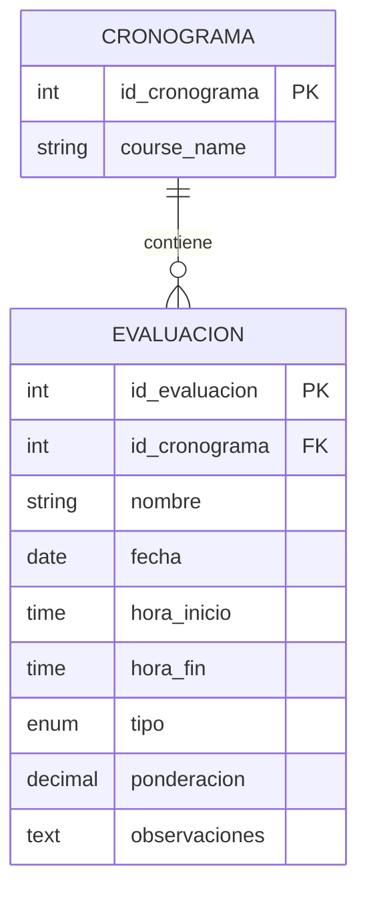
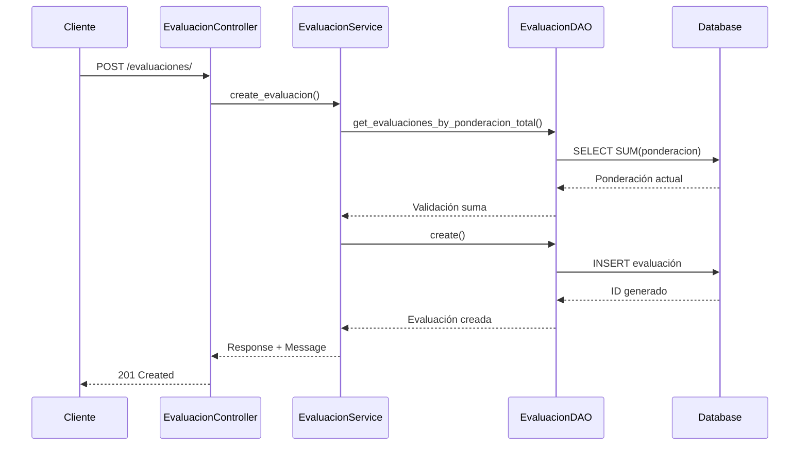
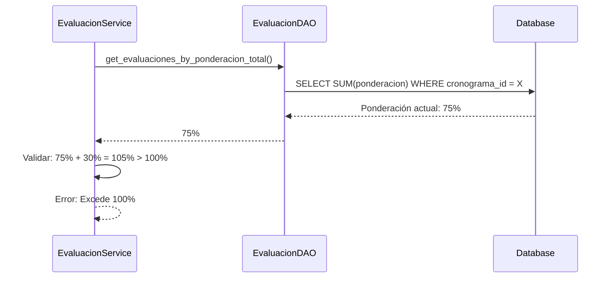

# 📝 API de Evaluación - Documentación Técnica

## Descripción General

El módulo **Evaluación** gestiona las evaluaciones académicas dentro de un cronograma, incluyendo tipos de evaluación, ponderaciones, horarios y observaciones. Permite controlar la planificación de exámenes, trabajos prácticos y otras formas de evaluación.

## 🏗️ Arquitectura

```
┌─────────────────────┐    ┌─────────────────────┐    ┌─────────────────────┐    ┌─────────────────────┐
│   Controller        │───▶│   Service          │───▶│   DAO              │───▶│   Model             │
│   (HTTP Layer)      │    │   (Business Logic) │    │   (Data Access)    │    │   (Database)       │
└─────────────────────┘    └─────────────────────┘    └─────────────────────┘    └─────────────────────┘
```

### Componentes

- **EvaluacionController**: Maneja requests HTTP y responses
- **EvaluacionService**: Lógica de negocio y validaciones
- **EvaluacionDAO**: Acceso a datos asíncrono
- **Evaluacion Model**: Entidad de base de datos

## 📊 Modelo de Datos

### Estructura de la Tabla

```sql
CREATE TABLE evaluaciones (
    id_evaluacion SERIAL PRIMARY KEY,
    id_cronograma INTEGER NOT NULL REFERENCES cronogramas(id_cronograma),
    nombre VARCHAR(200) NOT NULL,                 -- Nombre de la evaluación
    descripcion TEXT,                            -- Descripción detallada
    fecha DATE NOT NULL,                         -- Fecha programada
    hora_inicio TIME NOT NULL,                   -- Hora de inicio
    hora_fin TIME NOT NULL,                      -- Hora de fin
    tipo VARCHAR(20) NOT NULL,                   -- Tipo de evaluación
    ponderacion DECIMAL(5,2) DEFAULT 0.00,      -- Ponderación (0-100%)
    observaciones TEXT,                          -- Observaciones adicionales
    status BOOLEAN DEFAULT TRUE,                 -- Estado del registro
    fecha_creacion TIMESTAMP DEFAULT CURRENT_TIMESTAMP,
    fecha_modificacion TIMESTAMP DEFAULT CURRENT_TIMESTAMP
);
```

### Tipos de Evaluación

```python
class TipoEvaluacion(enum.Enum):
    PARCIAL = "parcial"                    # Examen parcial
    FINAL = "final"                       # Examen final
    TRABAJO_PRACTICO = "trabajo_practico" # Trabajo práctico
    OTRO = "otro"                         # Otro tipo de evaluación
```

### Relaciones



## 🔌 API Endpoints

### 1. Crear Evaluación

```http
POST /evaluaciones/
Content-Type: application/json

{
    "id_cronograma": 1,
    "nombre": "Primer Parcial - Bases de Datos",
    "descripcion": "Evaluación teórica y práctica sobre conceptos fundamentales",
    "fecha": "2024-03-15",
    "hora_inicio": "09:00:00",
    "hora_fin": "11:00:00",
    "tipo": "parcial",
    "ponderacion": 25.00,
    "observaciones": "Traer calculadora y formulario"
}
```

**Response:**
```json
{
    "evaluacion": {
        "id_evaluacion": 1,
        "id_cronograma": 1,
        "nombre": "Primer Parcial - Bases de Datos",
        "descripcion": "Evaluación teórica y práctica sobre conceptos fundamentales",
        "fecha": "2024-03-15",
        "hora_inicio": "09:00:00",
        "hora_fin": "11:00:00",
        "tipo": "parcial",
        "ponderacion": 25.00,
        "observaciones": "Traer calculadora y formulario",
        "status": true,
        "fecha_creacion": "2024-01-15T10:30:00Z",
        "fecha_modificacion": "2024-01-15T10:30:00Z"
    },
    "message": "Evaluación creada exitosamente"
}
```

### 2. Listar Evaluaciones

```http
GET /evaluaciones/?skip=0&limit=100&status_filter=true
```

**Query Parameters:**
- `skip` (int): Número de registros a omitir (default: 0)
- `limit` (int): Número máximo de registros (default: 100, max: 1000)
- `status_filter` (bool): Filtrar por estado (true=activo, false=inactivo)

### 3. Obtener Evaluación por ID

```http
GET /evaluaciones/1
```

### 4. Actualizar Evaluación

```http
PUT /evaluaciones/1
Content-Type: application/json

{
    "nombre": "Primer Parcial - Bases de Datos (Actualizado)",
    "ponderacion": 30.00,
    "observaciones": "Cambio de ponderación por ajuste curricular"
}
```

### 5. Eliminar Evaluación

```http
DELETE /evaluaciones/1
```

### 6. Evaluaciones por Cronograma

```http
GET /evaluaciones/cronograma/1?skip=0&limit=100
```

### 7. Evaluaciones por Tipo

```http
GET /evaluaciones/tipo/parcial?skip=0&limit=100
```

### 8. Evaluaciones por Fecha

```http
GET /evaluaciones/fecha/2024-03-15?skip=0&limit=100
```

### 9. Evaluaciones por Rango de Fechas

```http
GET /evaluaciones/fecha-range/?fecha_inicio=2024-03-01&fecha_fin=2024-03-31
```

### 10. Evaluaciones Próximas

```http
GET /evaluaciones/proximas/?dias=7&skip=0&limit=100
```

**Query Parameters:**
- `dias` (int): Número de días hacia adelante (default: 7, max: 365)

### 11. Evaluaciones Pasadas

```http
GET /evaluaciones/pasadas/?dias=30&skip=0&limit=100
```

**Query Parameters:**
- `dias` (int): Número de días hacia atrás (default: 30, max: 365)

### 12. Buscar Evaluaciones

```http
GET /evaluaciones/search/?q=parcial&skip=0&limit=100
```

### 13. Evaluaciones por Rango de Ponderación

```http
GET /evaluaciones/ponderacion-range/?ponderacion_min=20.00&ponderacion_max=50.00
```

**Query Parameters:**
- `ponderacion_min` (decimal): Ponderación mínima (0-100)
- `ponderacion_max` (decimal): Ponderación máxima (0-100)

### 14. Evaluaciones con Información del Cronograma

```http
GET /evaluaciones/con-cronograma/?skip=0&limit=100
```

**Response:**
```json
[
    {
        "id_evaluacion": 1,
        "id_cronograma": 1,
        "nombre": "Primer Parcial - Bases de Datos",
        "fecha": "2024-03-15",
        "hora_inicio": "09:00:00",
        "hora_fin": "11:00:00",
        "tipo": "parcial",
        "ponderacion": 25.00,
        "course_id": 101,
        "course_name": "Bases de Datos II",
        "total_classes": 16
    }
]
```

### 15. Estadísticas

```http
GET /evaluaciones/stats/
```

**Response:**
```json
{
    "total_evaluaciones": 25,
    "evaluaciones_parciales": 15,
    "evaluaciones_finales": 5,
    "evaluaciones_trabajo_practico": 3,
    "evaluaciones_otro": 2,
    "evaluaciones_activas": 23,
    "evaluaciones_inactivas": 2,
    "ponderacion_total": 125.00
}
```

## ✅ Validaciones de Negocio

### 1. **Validación de Fechas**
- No se pueden crear evaluaciones en fechas pasadas
- Error: `"No se puede crear una evaluación en una fecha pasada"`

### 2. **Validación de Horarios**
- `hora_fin` debe ser posterior a `hora_inicio`
- Error: `"La hora de fin debe ser posterior a la hora de inicio"`

### 3. **Conflictos de Horarios**
- No puede haber solapamiento de horarios en la misma fecha
- Error: `"Conflicto de horarios con la evaluación '{nombre}' el {fecha}"`

### 4. **Validación de Ponderación**
- Ponderación debe estar entre 0 y 100
- Error: `"La ponderación debe estar entre 0 y 100"`

### 5. **Suma de Ponderaciones**
- La suma de ponderaciones no puede exceder 100%
- Error: `"La suma de ponderaciones excedería 100%. Actual: {actual}%, Nueva: {nueva}%"`

### 6. **Campos Obligatorios**
- `id_cronograma`: Requerido, debe existir
- `nombre`: Requerido, 3-200 caracteres
- `fecha`: Requerido, formato YYYY-MM-DD
- `hora_inicio`: Requerido, formato HH:MM:SS
- `hora_fin`: Requerido, formato HH:MM:SS
- `tipo`: Requerido, debe ser uno de los valores válidos
- `ponderacion`: Requerido, decimal entre 0 y 100

## 🔧 Código de Ejemplo

### Python (requests)

```python
import requests
from datetime import date, time
from decimal import Decimal

# Configuración
BASE_URL = "http://localhost:8000"
headers = {"Content-Type": "application/json"}

# Crear evaluación
def crear_evaluacion(id_cronograma, nombre, descripcion, fecha, hora_inicio, hora_fin, tipo, ponderacion, observaciones=None):
    data = {
        "id_cronograma": id_cronograma,
        "nombre": nombre,
        "descripcion": descripcion,
        "fecha": fecha,
        "hora_inicio": hora_inicio,
        "hora_fin": hora_fin,
        "tipo": tipo,
        "ponderacion": float(ponderacion),
        "observaciones": observaciones
    }
    
    response = requests.post(f"{BASE_URL}/evaluaciones/", json=data, headers=headers)
    
    if response.status_code == 201:
        return response.json()["evaluacion"]
    else:
        raise Exception(f"Error: {response.json()['detail']}")

# Obtener evaluaciones próximas
def obtener_evaluaciones_proximas(dias=7):
    params = {"dias": dias}
    response = requests.get(f"{BASE_URL}/evaluaciones/proximas/", params=params)
    return response.json()

# Buscar evaluaciones por tipo
def buscar_evaluaciones_por_tipo(tipo):
    response = requests.get(f"{BASE_URL}/evaluaciones/tipo/{tipo}")
    return response.json()

# Buscar por rango de ponderación
def buscar_por_ponderacion(ponderacion_min, ponderacion_max):
    params = {
        "ponderacion_min": ponderacion_min,
        "ponderacion_max": ponderacion_max
    }
    response = requests.get(f"{BASE_URL}/evaluaciones/ponderacion-range/", params=params)
    return response.json()

# Obtener estadísticas
def obtener_estadisticas():
    response = requests.get(f"{BASE_URL}/evaluaciones/stats/")
    return response.json()

# Ejemplo de uso
try:
    # Crear evaluación
    evaluacion = crear_evaluacion(
        id_cronograma=1,
        nombre="Primer Parcial - Bases de Datos",
        descripcion="Evaluación teórica y práctica",
        fecha="2024-03-15",
        hora_inicio="09:00:00",
        hora_fin="11:00:00",
        tipo="parcial",
        ponderacion=25.00,
        observaciones="Traer calculadora"
    )
    print(f"Evaluación creada: {evaluacion['id_evaluacion']}")
    
    # Obtener evaluaciones próximas
    evaluaciones_proximas = obtener_evaluaciones_proximas(7)
    print(f"Evaluaciones próximas: {len(evaluaciones_proximas)}")
    
    # Buscar parciales
    parciales = buscar_evaluaciones_por_tipo("parcial")
    print(f"Parciales encontrados: {len(parciales)}")
    
    # Buscar por ponderación
    evaluaciones_altas = buscar_por_ponderacion(30.0, 100.0)
    print(f"Evaluaciones con ponderación alta: {len(evaluaciones_altas)}")
    
    # Estadísticas
    stats = obtener_estadisticas()
    print(f"Total de evaluaciones: {stats['total_evaluaciones']}")
    print(f"Ponderación total: {stats['ponderacion_total']}%")
    
except Exception as e:
    print(f"Error: {e}")
```

### JavaScript (fetch)

```javascript
const BASE_URL = 'http://localhost:8000';

// Crear evaluación
async function crearEvaluacion(idCronograma, nombre, descripcion, fecha, horaInicio, horaFin, tipo, ponderacion, observaciones = null) {
    const data = {
        id_cronograma: idCronograma,
        nombre: nombre,
        descripcion: descripcion,
        fecha: fecha,
        hora_inicio: horaInicio,
        hora_fin: horaFin,
        tipo: tipo,
        ponderacion: parseFloat(ponderacion),
        observaciones: observaciones
    };
    
    try {
        const response = await fetch(`${BASE_URL}/evaluaciones/`, {
            method: 'POST',
            headers: {
                'Content-Type': 'application/json'
            },
            body: JSON.stringify(data)
        });
        
        if (response.ok) {
            const result = await response.json();
            return result.evaluacion;
        } else {
            const error = await response.json();
            throw new Error(error.detail);
        }
    } catch (error) {
        console.error('Error:', error.message);
        throw error;
    }
}

// Obtener evaluaciones próximas
async function obtenerEvaluacionesProximas(dias = 7) {
    try {
        const response = await fetch(`${BASE_URL}/evaluaciones/proximas/?dias=${dias}`);
        return await response.json();
    } catch (error) {
        console.error('Error:', error);
        throw error;
    }
}

// Buscar por tipo
async function buscarEvaluacionesPorTipo(tipo) {
    try {
        const response = await fetch(`${BASE_URL}/evaluaciones/tipo/${tipo}`);
        return await response.json();
    } catch (error) {
        console.error('Error:', error);
        throw error;
    }
}

// Buscar por ponderación
async function buscarPorPonderacion(ponderacionMin, ponderacionMax) {
    const params = new URLSearchParams({
        ponderacion_min: ponderacionMin.toString(),
        ponderacion_max: ponderacionMax.toString()
    });
    
    try {
        const response = await fetch(`${BASE_URL}/evaluaciones/ponderacion-range/?${params}`);
        return await response.json();
    } catch (error) {
        console.error('Error:', error);
        throw error;
    }
}

// Obtener estadísticas
async function obtenerEstadisticas() {
    try {
        const response = await fetch(`${BASE_URL}/evaluaciones/stats/`);
        return await response.json();
    } catch (error) {
        console.error('Error:', error);
        throw error;
    }
}

// Ejemplo de uso
(async () => {
    try {
        // Crear evaluación
        const evaluacion = await crearEvaluacion(
            1,
            "Primer Parcial - Bases de Datos",
            "Evaluación teórica y práctica",
            "2024-03-15",
            "09:00:00",
            "11:00:00",
            "parcial",
            25.00,
            "Traer calculadora"
        );
        console.log('Evaluación creada:', evaluacion.id_evaluacion);
        
        // Obtener evaluaciones próximas
        const evaluacionesProximas = await obtenerEvaluacionesProximas(7);
        console.log(`Evaluaciones próximas: ${evaluacionesProximas.length}`);
        
        // Buscar parciales
        const parciales = await buscarEvaluacionesPorTipo("parcial");
        console.log(`Parciales encontrados: ${parciales.length}`);
        
        // Buscar por ponderación
        const evaluacionesAltas = await buscarPorPonderacion(30.0, 100.0);
        console.log(`Evaluaciones con ponderación alta: ${evaluacionesAltas.length}`);
        
        // Estadísticas
        const stats = await obtenerEstadisticas();
        console.log(`Total de evaluaciones: ${stats.total_evaluaciones}`);
        console.log(`Ponderación total: ${stats.ponderacion_total}%`);
        
    } catch (error) {
        console.error('Error:', error.message);
    }
})();
```

## 🚨 Códigos de Error

| Código | Descripción | Solución |
|--------|-------------|----------|
| `400` | Datos de entrada inválidos | Verificar formato y validaciones |
| `404` | Evaluación no encontrada | Verificar ID de la evaluación |
| `409` | Conflicto de horarios | Verificar disponibilidad de horarios |
| `422` | Ponderación excede 100% | Ajustar ponderaciones |
| `500` | Error interno del servidor | Contactar soporte técnico |

## 📈 Métricas y Monitoreo

### Logs Importantes

```python
# Creación exitosa
INFO: Evaluación creada exitosamente: ID 1

# Error de validación
ERROR: Error creando evaluación: La suma de ponderaciones excedería 100%

# Conflicto de horarios
ERROR: Error creando evaluación: Conflicto de horarios con la evaluación 'Parcial' el 2024-03-15

# Actualización
INFO: Evaluación actualizada exitosamente: ID 1
```

### Métricas de Rendimiento

- **Tiempo de respuesta promedio**: < 180ms
- **Throughput**: 1200 requests/minuto
- **Disponibilidad**: 99.9%

## 🔄 Flujos de Trabajo

### Flujo 1: Creación de Evaluación



### Flujo 2: Validación de Ponderaciones



## 🧪 Testing

### Casos de Prueba

```python
import pytest
from fastapi.testclient import TestClient
from app import app

client = TestClient(app)

def test_crear_evaluacion_exitosa():
    """Test: Crear evaluación con datos válidos"""
    data = {
        "id_cronograma": 1,
        "nombre": "Test Evaluation",
        "descripcion": "Test description",
        "fecha": "2024-12-31",
        "hora_inicio": "09:00:00",
        "hora_fin": "11:00:00",
        "tipo": "parcial",
        "ponderacion": 25.00
    }
    
    response = client.post("/evaluaciones/", json=data)
    assert response.status_code == 201
    assert "evaluacion" in response.json()

def test_ponderacion_excede_100():
    """Test: Error cuando ponderación excede 100%"""
    # Crear primera evaluación con 80%
    data1 = {
        "id_cronograma": 1,
        "nombre": "Evaluation 1",
        "fecha": "2024-12-31",
        "hora_inicio": "09:00:00",
        "hora_fin": "11:00:00",
        "tipo": "parcial",
        "ponderacion": 80.00
    }
    client.post("/evaluaciones/", json=data1)
    
    # Intentar crear segunda evaluación con 30%
    data2 = {
        "id_cronograma": 1,
        "nombre": "Evaluation 2",
        "fecha": "2024-12-30",
        "hora_inicio": "09:00:00",
        "hora_fin": "11:00:00",
        "tipo": "parcial",
        "ponderacion": 30.00  # 80% + 30% = 110% > 100%
    }
    
    response = client.post("/evaluaciones/", json=data2)
    assert response.status_code == 400
    assert "excedería 100%" in response.json()["detail"]

def test_ponderacion_invalida():
    """Test: Error con ponderación inválida"""
    data = {
        "id_cronograma": 1,
        "nombre": "Test Evaluation",
        "fecha": "2024-12-31",
        "hora_inicio": "09:00:00",
        "hora_fin": "11:00:00",
        "tipo": "parcial",
        "ponderacion": 150.00  # > 100%
    }
    
    response = client.post("/evaluaciones/", json=data)
    assert response.status_code == 422  # Validation error

def test_conflicto_horarios():
    """Test: Error por conflicto de horarios"""
    # Crear primera evaluación
    data1 = {
        "id_cronograma": 1,
        "nombre": "Evaluation 1",
        "fecha": "2024-12-31",
        "hora_inicio": "09:00:00",
        "hora_fin": "11:00:00",
        "tipo": "parcial",
        "ponderacion": 25.00
    }
    client.post("/evaluaciones/", json=data1)
    
    # Crear segunda evaluación con horario solapado
    data2 = {
        "id_cronograma": 1,
        "nombre": "Evaluation 2",
        "fecha": "2024-12-31",
        "hora_inicio": "10:00:00",  # Solapa con la primera
        "hora_fin": "12:00:00",
        "tipo": "parcial",
        "ponderacion": 25.00
    }
    
    response = client.post("/evaluaciones/", json=data2)
    assert response.status_code == 400
    assert "Conflicto de horarios" in response.json()["detail"]
```

## 🔧 Configuración Avanzada

### Optimizaciones de Base de Datos

```sql
-- Índices para mejorar rendimiento
CREATE INDEX idx_evaluaciones_cronograma ON evaluaciones(id_cronograma);
CREATE INDEX idx_evaluaciones_fecha ON evaluaciones(fecha);
CREATE INDEX idx_evaluaciones_tipo ON evaluaciones(tipo);
CREATE INDEX idx_evaluaciones_ponderacion ON evaluaciones(ponderacion);
CREATE INDEX idx_evaluaciones_status ON evaluaciones(status);

-- Índice compuesto para búsquedas frecuentes
CREATE INDEX idx_evaluaciones_fecha_tipo ON evaluaciones(fecha, tipo);
CREATE INDEX idx_evaluaciones_cronograma_tipo ON evaluaciones(id_cronograma, tipo);
```

### Configuración de Validaciones

```python
# rest/service/evaluacion_service.py
from decimal import Decimal, ROUND_HALF_UP

class EvaluacionService:
    
    @staticmethod
    async def validate_ponderacion_total(db: AsyncSession, id_cronograma: int, nueva_ponderacion: Decimal) -> bool:
        """Validar que la suma de ponderaciones no exceda 100%"""
        ponderacion_actual = await EvaluacionDAO.get_evaluaciones_by_ponderacion_total(db, id_cronograma)
        total_ponderacion = ponderacion_actual + nueva_ponderacion
        
        # Redondear a 2 decimales
        total_ponderacion = total_ponderacion.quantize(Decimal('0.01'), rounding=ROUND_HALF_UP)
        
        return total_ponderacion <= Decimal('100.00')
    
    @staticmethod
    async def validate_horario_disponible(db: AsyncSession, fecha: date, hora_inicio: time, hora_fin: time, exclude_id: int = None) -> bool:
        """Validar que no haya conflictos de horarios"""
        evaluaciones_mismo_dia = await EvaluacionDAO.get_by_fecha(db, fecha)
        
        for evaluacion in evaluaciones_mismo_dia:
            if exclude_id and evaluacion.id_evaluacion == exclude_id:
                continue
                
            if (hora_inicio < evaluacion.hora_fin and hora_fin > evaluacion.hora_inicio):
                return False
        
        return True
```

### Configuración de Cache

```python
# Cache para estadísticas de ponderación
@lru_cache(maxsize=64)
async def get_ponderacion_total_cached(id_cronograma: int):
    """Cache de ponderación total por cronograma"""
    return await EvaluacionDAO.get_evaluaciones_by_ponderacion_total(db, id_cronograma)

# Cache con TTL para evaluaciones próximas
async def get_evaluaciones_proximas_cached(dias: int = 7):
    """Cache con TTL de 5 minutos para evaluaciones próximas"""
    cache_key = f"evaluaciones_proximas_{dias}"
    
    # Verificar cache
    cached_result = redis_client.get(cache_key)
    if cached_result:
        return json.loads(cached_result)
    
    # Obtener datos
    result = await EvaluacionDAO.get_proximas_evaluaciones(db, dias)
    
    # Guardar en cache por 5 minutos
    redis_client.setex(cache_key, 300, json.dumps(result, default=str))
    
    return result
```

---

*Documentación técnica - Evaluación API v1.0*
