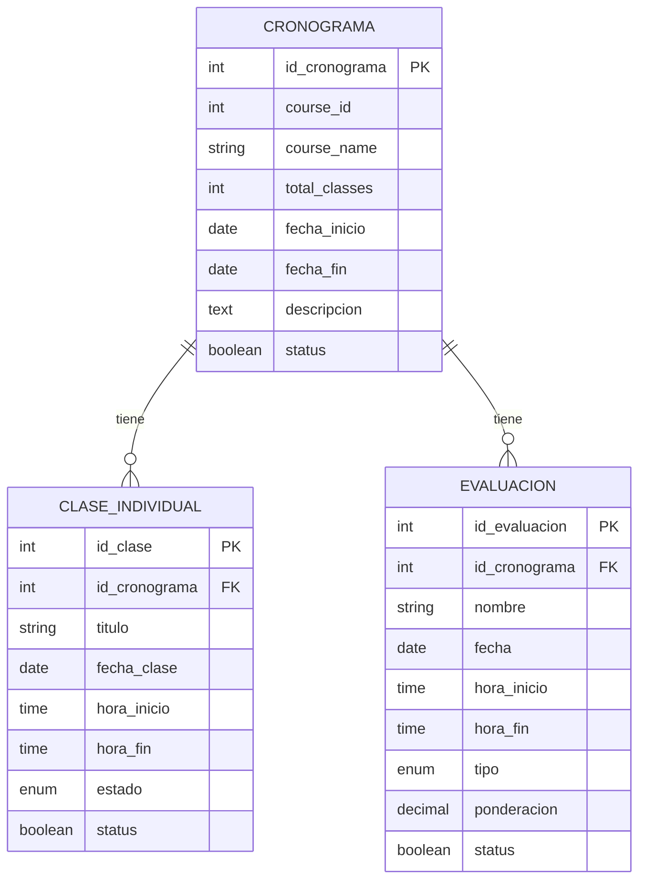

# Documentación de Módulos Principales - BackOffice API

## 📋 Índice

1. [Cronograma](#cronograma)
2. [ClaseIndividual](#claseindividual)
3. [Evaluacion](#evaluacion)
4. [Arquitectura General](#arquitectura-general)
5. [Ejemplos de Uso](#ejemplos-de-uso)

---

## 🗓️ Cronograma

### Descripción
El módulo **Cronograma** gestiona la planificación general de cursos académicos, incluyendo fechas de inicio/fin, descripción y metadatos del curso.

### Arquitectura

```
CronogramaController → CronogramaService → CronogramaDAO → Cronograma (Model)
```

### Modelo de Datos

```python
class Cronograma(Base):
    __tablename__ = "cronogramas"
    
    id_cronograma: int (PK)
    course_id: int (FK al módulo CORE)
    course_name: str (200 chars)
    total_classes: int (default: 0)
    fecha_inicio: date (opcional)
    fecha_fin: date (opcional)
    descripcion: text (opcional)
    status: bool (default: True)
    fecha_creacion: datetime (auto)
    fecha_modificacion: datetime (auto)
```

### Endpoints API

| Método | Endpoint | Descripción |
|--------|----------|-------------|
| `POST` | `/cronogramas/` | Crear cronograma |
| `GET` | `/cronogramas/` | Listar cronogramas |
| `GET` | `/cronogramas/{id}` | Obtener por ID |
| `PUT` | `/cronogramas/{id}` | Actualizar cronograma |
| `DELETE` | `/cronogramas/{id}` | Eliminar cronograma |
| `GET` | `/cronogramas/course/{course_id}` | Por ID de curso |
| `GET` | `/cronogramas/search/` | Búsqueda por texto |
| `GET` | `/cronogramas/date-range/` | Por rango de fechas |
| `GET` | `/cronogramas/stats/` | Estadísticas |

### Ejemplo de Uso

```python
# Crear cronograma
cronograma_data = {
    "course_id": 101,
    "course_name": "Bases de Datos II",
    "total_classes": 16,
    "fecha_inicio": "2024-02-15",
    "fecha_fin": "2024-06-15",
    "descripcion": "Curso avanzado de bases de datos relacionales"
}

response = requests.post("/cronogramas/", json=cronograma_data)
```

### Validaciones de Negocio

- ✅ **Unicidad**: Un solo cronograma por `course_id`
- ✅ **Fechas**: `fecha_fin` debe ser posterior a `fecha_inicio`
- ✅ **Integridad**: No se puede eliminar si tiene clases/evaluaciones asociadas

---

## 📚 ClaseIndividual

### Descripción
El módulo **ClaseIndividual** gestiona las clases específicas dentro de un cronograma, incluyendo horarios, temas y estados.

### Arquitectura

```
ClaseIndividualController → ClaseIndividualService → ClaseIndividualDAO → ClaseIndividual (Model)
```

### Modelo de Datos

```python
class ClaseIndividual(Base):
    __tablename__ = "clases_individuales"
    
    id_clase: int (PK)
    id_cronograma: int (FK)
    titulo: str (200 chars)
    descripcion: text (opcional)
    fecha_clase: date
    hora_inicio: time
    hora_fin: time
    estado: EstadoClase (enum)
    observaciones: text (opcional)
    status: bool (default: True)
    fecha_creacion: datetime (auto)
    fecha_modificacion: datetime (auto)

class EstadoClase(enum.Enum):
    PROGRAMADA = "programada"
    DICTADA = "dictada"
    REPROGRAMADA = "reprogramada"
    CANCELADA = "cancelada"
```

### Endpoints API

| Método | Endpoint | Descripción |
|--------|----------|-------------|
| `POST` | `/clases-individuales/` | Crear clase |
| `GET` | `/clases-individuales/` | Listar clases |
| `GET` | `/clases-individuales/{id}` | Obtener por ID |
| `PUT` | `/clases-individuales/{id}` | Actualizar clase |
| `DELETE` | `/clases-individuales/{id}` | Eliminar clase |
| `GET` | `/clases-individuales/cronograma/{id}` | Por cronograma |
| `GET` | `/clases-individuales/estado/{estado}` | Por estado |
| `GET` | `/clases-individuales/fecha/{fecha}` | Por fecha |
| `GET` | `/clases-individuales/fecha-range/` | Por rango de fechas |
| `GET` | `/clases-individuales/proximas/` | Clases próximas |
| `GET` | `/clases-individuales/pasadas/` | Clases pasadas |
| `GET` | `/clases-individuales/search/` | Búsqueda por texto |
| `GET` | `/clases-individuales/con-cronograma/` | Con info del cronograma |
| `GET` | `/clases-individuales/stats/` | Estadísticas |

### Ejemplo de Uso

```python
# Crear clase individual
clase_data = {
    "id_cronograma": 1,
    "titulo": "Introducción a Bases de Datos",
    "descripcion": "Conceptos fundamentales de BD relacionales",
    "fecha_clase": "2024-02-15",
    "hora_inicio": "09:00:00",
    "hora_fin": "11:00:00",
    "estado": "programada",
    "observaciones": "Traer laptops para práctica"
}

response = requests.post("/clases-individuales/", json=clase_data)
```

### Validaciones de Negocio

- ✅ **Fechas**: No se pueden crear clases en fechas pasadas
- ✅ **Horarios**: `hora_fin` debe ser posterior a `hora_inicio`
- ✅ **Conflictos**: No puede haber solapamiento de horarios en la misma fecha
- ✅ **Eliminación**: No se puede eliminar una clase ya dictada

---

## 📝 Evaluacion

### Descripción
El módulo **Evaluacion** gestiona las evaluaciones académicas dentro de un cronograma, incluyendo tipos, ponderaciones y horarios.

### Arquitectura

```
EvaluacionController → EvaluacionService → EvaluacionDAO → Evaluacion (Model)
```

### Modelo de Datos

```python
class Evaluacion(Base):
    __tablename__ = "evaluaciones"
    
    id_evaluacion: int (PK)
    id_cronograma: int (FK)
    nombre: str (200 chars)
    descripcion: text (opcional)
    fecha: date
    hora_inicio: time
    hora_fin: time
    tipo: TipoEvaluacion (enum)
    ponderacion: Decimal (0-100%)
    observaciones: text (opcional)
    status: bool (default: True)
    fecha_creacion: datetime (auto)
    fecha_modificacion: datetime (auto)

class TipoEvaluacion(enum.Enum):
    PARCIAL = "parcial"
    FINAL = "final"
    TRABAJO_PRACTICO = "trabajo_practico"
    OTRO = "otro"
```

### Endpoints API

| Método | Endpoint | Descripción |
|--------|----------|-------------|
| `POST` | `/evaluaciones/` | Crear evaluación |
| `GET` | `/evaluaciones/` | Listar evaluaciones |
| `GET` | `/evaluaciones/{id}` | Obtener por ID |
| `PUT` | `/evaluaciones/{id}` | Actualizar evaluación |
| `DELETE` | `/evaluaciones/{id}` | Eliminar evaluación |
| `GET` | `/evaluaciones/cronograma/{id}` | Por cronograma |
| `GET` | `/evaluaciones/tipo/{tipo}` | Por tipo |
| `GET` | `/evaluaciones/fecha/{fecha}` | Por fecha |
| `GET` | `/evaluaciones/fecha-range/` | Por rango de fechas |
| `GET` | `/evaluaciones/proximas/` | Evaluaciones próximas |
| `GET` | `/evaluaciones/pasadas/` | Evaluaciones pasadas |
| `GET` | `/evaluaciones/search/` | Búsqueda por texto |
| `GET` | `/evaluaciones/ponderacion-range/` | Por rango de ponderación |
| `GET` | `/evaluaciones/con-cronograma/` | Con info del cronograma |
| `GET` | `/evaluaciones/stats/` | Estadísticas |

### Ejemplo de Uso

```python
# Crear evaluación
evaluacion_data = {
    "id_cronograma": 1,
    "nombre": "Primer Parcial - Bases de Datos",
    "descripcion": "Evaluación teórica y práctica",
    "fecha": "2024-03-15",
    "hora_inicio": "09:00:00",
    "hora_fin": "11:00:00",
    "tipo": "parcial",
    "ponderacion": 25.00,
    "observaciones": "Traer calculadora y formulario"
}

response = requests.post("/evaluaciones/", json=evaluacion_data)
```

### Validaciones de Negocio

- ✅ **Fechas**: No se pueden crear evaluaciones en fechas pasadas
- ✅ **Horarios**: `hora_fin` debe ser posterior a `hora_inicio`
- ✅ **Conflictos**: No puede haber solapamiento de horarios en la misma fecha
- ✅ **Ponderación**: La suma de ponderaciones no puede exceder 100%
- ✅ **Rango**: Ponderación debe estar entre 0 y 100%

---

## 🏗️ Arquitectura General

### Patrón de Diseño
Todos los módulos siguen el patrón **Layered Architecture**:

```
Controller Layer (HTTP) 
    ↓
Service Layer (Business Logic)
    ↓
DAO Layer (Data Access)
    ↓
Model Layer (Database)
```

### Características Técnicas

#### ✅ **Asíncrono**
- Todos los métodos usan `async/await`
- Compatible con FastAPI
- No bloquea el hilo principal

#### ✅ **Validaciones**
- **Pydantic**: Validación de datos de entrada
- **SQLAlchemy**: Validación a nivel de base de datos
- **Business Logic**: Validaciones de negocio en Service Layer

#### ✅ **Manejo de Errores**
- **HTTP Status Codes**: 200, 201, 400, 404, 500
- **Mensajes Descriptivos**: Errores claros para el usuario
- **Logging**: Registro de errores para debugging

#### ✅ **Documentación**
- **Swagger UI**: Documentación automática en `/docs`
- **ReDoc**: Documentación alternativa en `/redoc`
- **Type Hints**: Tipado estático en Python

### Base de Datos

#### **PostgreSQL** (Producción)
```sql
-- Ejemplo de tabla Cronograma
CREATE TABLE cronogramas (
    id_cronograma SERIAL PRIMARY KEY,
    course_id INTEGER NOT NULL,
    course_name VARCHAR(200) NOT NULL,
    total_classes INTEGER DEFAULT 0,
    fecha_inicio DATE,
    fecha_fin DATE,
    descripcion TEXT,
    fecha_creacion TIMESTAMP DEFAULT CURRENT_TIMESTAMP,
    fecha_modificacion TIMESTAMP DEFAULT CURRENT_TIMESTAMP,
    status BOOLEAN DEFAULT TRUE
);
```

#### **Relaciones**


---

## 💡 Ejemplos de Uso

### Flujo Completo: Crear Cronograma con Clases y Evaluaciones

```python
import requests
from datetime import date, time

# 1. Crear cronograma
cronograma_data = {
    "course_id": 101,
    "course_name": "Bases de Datos II",
    "total_classes": 16,
    "fecha_inicio": "2024-02-15",
    "fecha_fin": "2024-06-15",
    "descripcion": "Curso avanzado de bases de datos relacionales"
}

cronograma_response = requests.post("/cronogramas/", json=cronograma_data)
cronograma_id = cronograma_response.json()["cronograma"]["id_cronograma"]

# 2. Crear clases individuales
clases_data = [
    {
        "id_cronograma": cronograma_id,
        "titulo": "Introducción a Bases de Datos",
        "descripcion": "Conceptos fundamentales",
        "fecha_clase": "2024-02-15",
        "hora_inicio": "09:00:00",
        "hora_fin": "11:00:00",
        "estado": "programada"
    },
    {
        "id_cronograma": cronograma_id,
        "titulo": "Modelado Entidad-Relación",
        "descripcion": "Diseño de esquemas",
        "fecha_clase": "2024-02-22",
        "hora_inicio": "09:00:00",
        "hora_fin": "11:00:00",
        "estado": "programada"
    }
]

for clase_data in clases_data:
    requests.post("/clases-individuales/", json=clase_data)

# 3. Crear evaluaciones
evaluaciones_data = [
    {
        "id_cronograma": cronograma_id,
        "nombre": "Primer Parcial",
        "descripcion": "Evaluación teórica",
        "fecha": "2024-03-15",
        "hora_inicio": "09:00:00",
        "hora_fin": "11:00:00",
        "tipo": "parcial",
        "ponderacion": 25.00
    },
    {
        "id_cronograma": cronograma_id,
        "nombre": "Examen Final",
        "descripcion": "Evaluación integral",
        "fecha": "2024-06-20",
        "hora_inicio": "09:00:00",
        "hora_fin": "12:00:00",
        "tipo": "final",
        "ponderacion": 50.00
    }
]

for evaluacion_data in evaluaciones_data:
    requests.post("/evaluaciones/", json=evaluacion_data)

# 4. Obtener estadísticas
cronograma_stats = requests.get("/cronogramas/stats/")
clases_stats = requests.get("/clases-individuales/stats/")
evaluaciones_stats = requests.get("/evaluaciones/stats/")

print("Estadísticas del sistema:")
print(f"Cronogramas: {cronograma_stats.json()}")
print(f"Clases: {clases_stats.json()}")
print(f"Evaluaciones: {evaluaciones_stats.json()}")
```

### Consultas Avanzadas

```python
# Buscar clases próximas
clases_proximas = requests.get("/clases-individuales/proximas/?dias=7")

# Buscar evaluaciones por tipo
evaluaciones_parciales = requests.get("/evaluaciones/tipo/parcial")

# Buscar por rango de fechas
clases_rango = requests.get("/clases-individuales/fecha-range/?fecha_inicio=2024-02-01&fecha_fin=2024-02-29")

# Búsqueda por texto
resultados = requests.get("/evaluaciones/search/?q=parcial")
```

### Manejo de Errores

```python
try:
    response = requests.post("/cronogramas/", json=invalid_data)
    response.raise_for_status()
except requests.exceptions.HTTPError as e:
    if e.response.status_code == 400:
        error_detail = e.response.json()["detail"]
        print(f"Error de validación: {error_detail}")
    elif e.response.status_code == 404:
        print("Recurso no encontrado")
    else:
        print(f"Error del servidor: {e.response.status_code}")
```

---

## 🔧 Configuración y Despliegue

### Variables de Entorno

```bash
# Base de datos
DATABASE_HOST=localhost
DATABASE_PORT=5432
DATABASE_NAME=backoffice_db
DATABASE_USER=postgres
DATABASE_PASSWORD=tu_password

# Servidor
SERVER_HOST=0.0.0.0
SERVER_PORT=8000
ENVIRONMENT=development
```

### Instalación

```bash
# 1. Clonar repositorio
git clone <repository-url>
cd backoffice

# 2. Crear entorno virtual
python -m venv venv
source venv/bin/activate  # Linux/Mac
# venv\Scripts\activate  # Windows

# 3. Instalar dependencias
pip install -r requirements.txt

# 4. Configurar base de datos
cp env.example .env
# Editar .env con tus credenciales

# 5. Inicializar sistema
python setup.py

# 6. Ejecutar servidor
python run_server.py
```

### URLs de Acceso

- **API**: http://localhost:8000
- **Swagger UI**: http://localhost:8000/docs
- **ReDoc**: http://localhost:8000/redoc

---

## 📊 Métricas y Monitoreo

### Endpoints de Estadísticas

```python
# Estadísticas generales
GET /cronogramas/stats/
GET /clases-individuales/stats/
GET /evaluaciones/stats/

# Respuesta ejemplo:
{
    "total_cronogramas": 15,
    "active_cronogramas": 12,
    "inactive_cronogramas": 3,
    "cronogramas_with_classes": 10,
    "cronogramas_without_classes": 2
}
```

### Logging

```python
import logging

# Configurar logging
logging.basicConfig(
    level=logging.INFO,
    format='%(asctime)s - %(name)s - %(levelname)s - %(message)s'
)

# Los servicios registran automáticamente:
# - Creación de recursos
# - Errores de validación
# - Operaciones de base de datos
```

---

## 🚀 Próximos Pasos

### Mejoras Planificadas

1. **Autenticación y Autorización**
   - JWT tokens
   - Roles y permisos
   - Middleware de seguridad

2. **Notificaciones**
   - Email para clases próximas
   - Recordatorios de evaluaciones
   - Alertas de cambios

3. **Reportes**
   - PDF de cronogramas
   - Estadísticas por período
   - Exportación de datos

4. **Integración**
   - API del módulo CORE
   - Sincronización automática
   - Webhooks

### Contribución

Para contribuir al proyecto:

1. Fork del repositorio
2. Crear branch de feature
3. Implementar cambios
4. Ejecutar tests
5. Crear Pull Request

---

## 📞 Soporte

Para soporte técnico o consultas:

- **Documentación**: `/docs` en el servidor
- **Issues**: GitHub Issues
- **Email**: soporte@backoffice.edu

---

*Documentación generada automáticamente - BackOffice API v1.0*
